# Setting up Azure

**Last Edited:** Astrid Gealer, 17th July 2025

Setting up Azure to work with this is quite difficult, but hopefully this guide will help you set it up!

The first thing you want to do is sign up for a new Azure subscription. You can use the free tier from their site. This part varies from region to region.

> **NOTE:** Not all subscriptions can see all VMs! You need to be able to see all of the virtual machines you want extra specifications about. Not being free tier likely helps here. ec2instances is deployed using an American non-free tier Azure user.

## Creating the application

When you have an account, you now want to make an application. Search for "App registrations" in the search and click it:

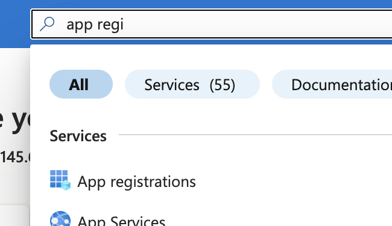

From here, click "New registration" make a new name for your application that you can remember. Leave everything else as it is, and don't set a redirect URI.

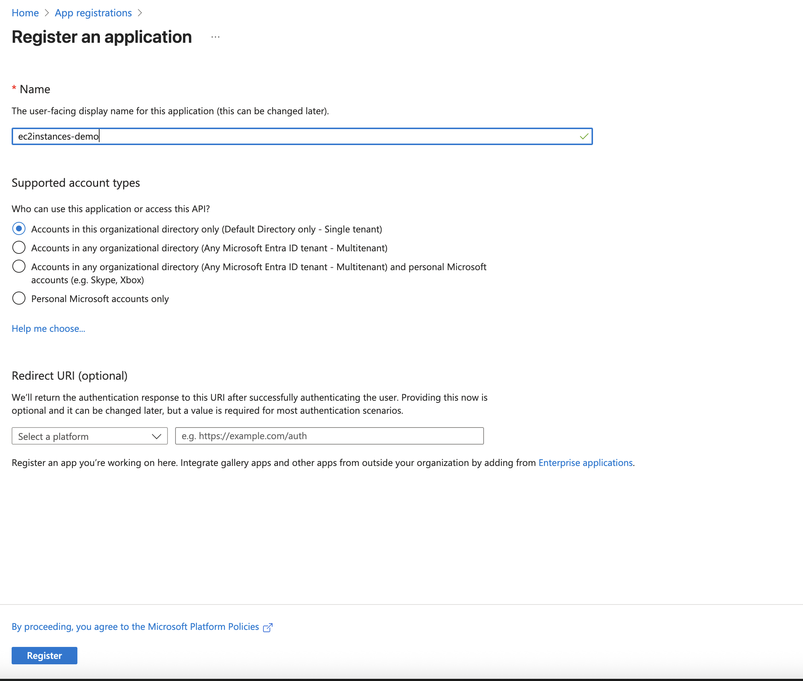

When you get to the created application, note down the Directory ID (this is your `AZURE_TENANT_ID`) and Application ID (this is your `AZURE_CLIENT_ID`). Now in Manage in the sidebar, click on "API permissions".

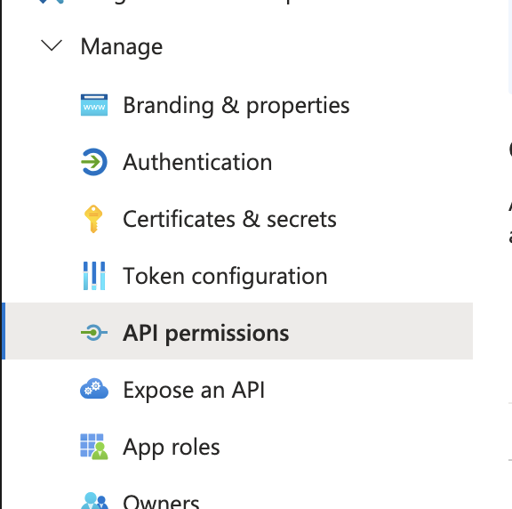

From here, we will want to add the `user_impersonation` role. To do this, click "Add a permission", "Azure Service Management", and then tick "user_impersonation". You can then click add permissions.

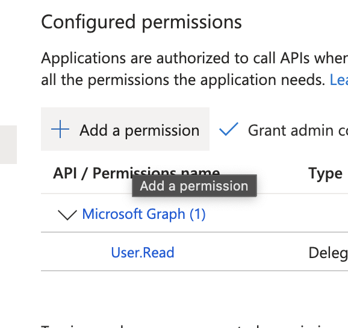
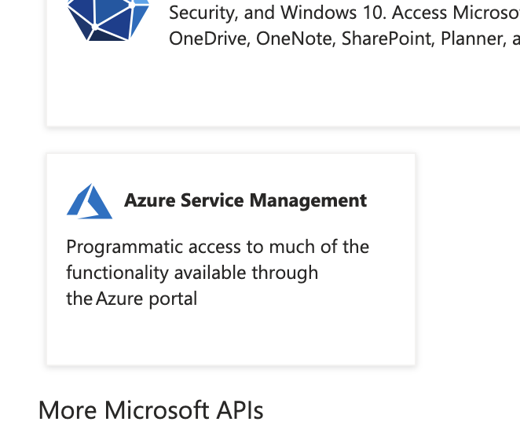
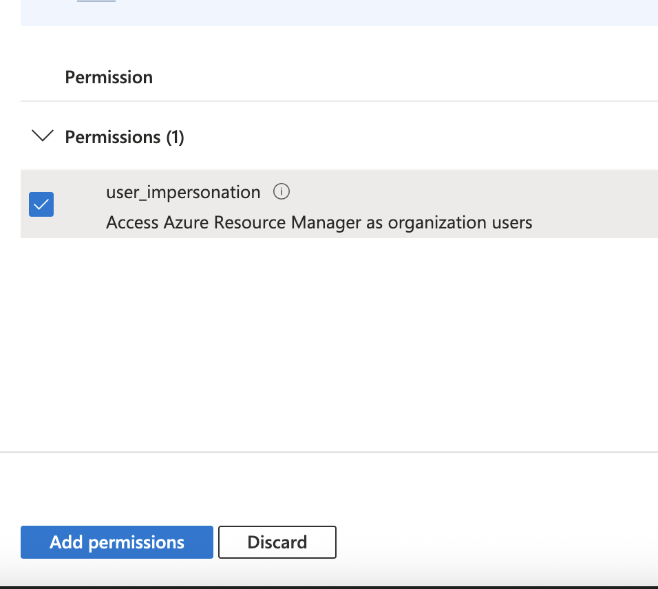

**IMPORTANT:** After you do this, you MUST click "Grant admin consent for default directory" and then click Yes.

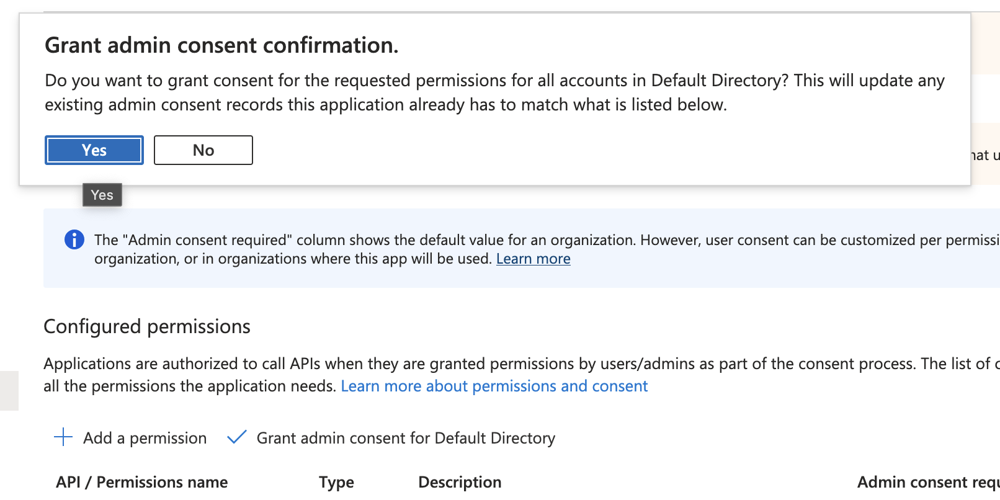

## Creating the API key

To create the API key, go over to "Certificates & secrets" in the manage sidebar. From here, click "Client secrets", "New client secret", and make a new client secret.

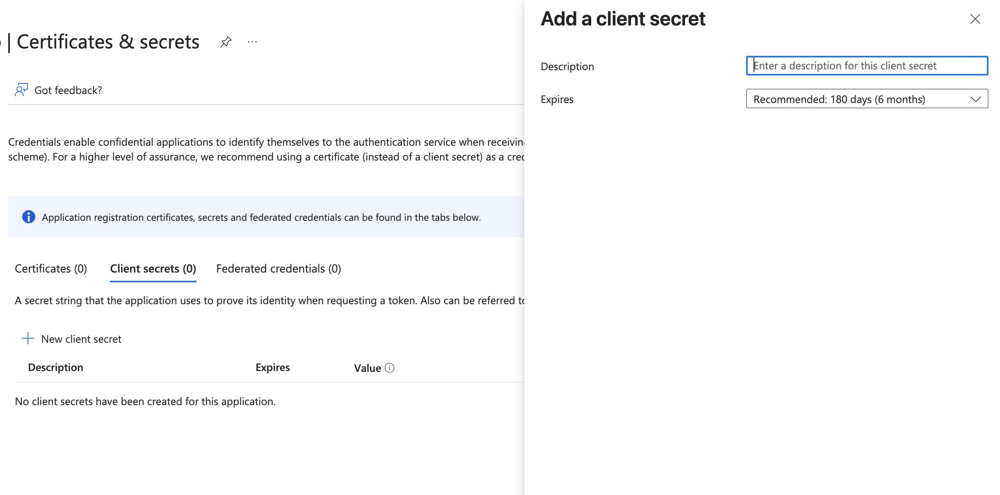

Copy the value that it specifies (this is your `AZURE_CLIENT_SECRET`). You can ignore the ID.

## Attaching the application to a subscription

Now we have the application, we need to tie it to a subscription so we can get instance information from it. To do this, search for "Subscriptions" in Azure and find your subscription. Click it and then click "Access control (IAM)". From here, click "Add" and then subsequently "Add role assignment". In role, assign "Reader".

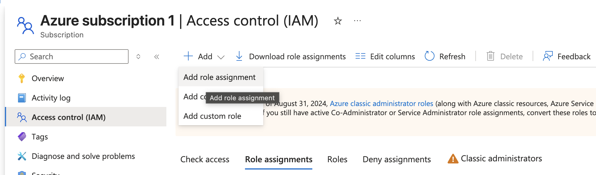
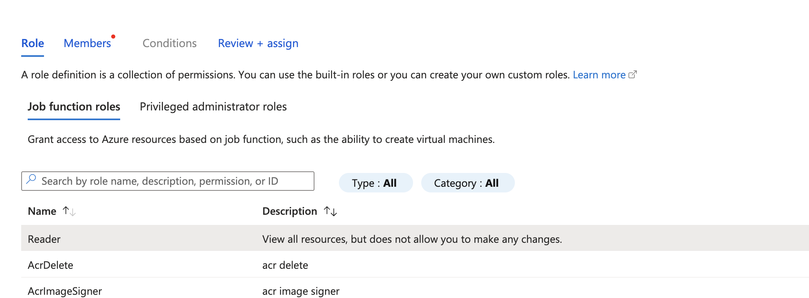

Then in the top where it says "Members" click that. Make sure assign access to is set to "User, group, or service principal" and then click "Select members". In the search page, type the name of your application. It should show up and be selectable.

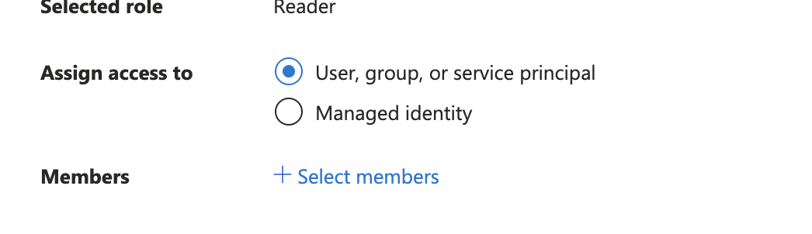
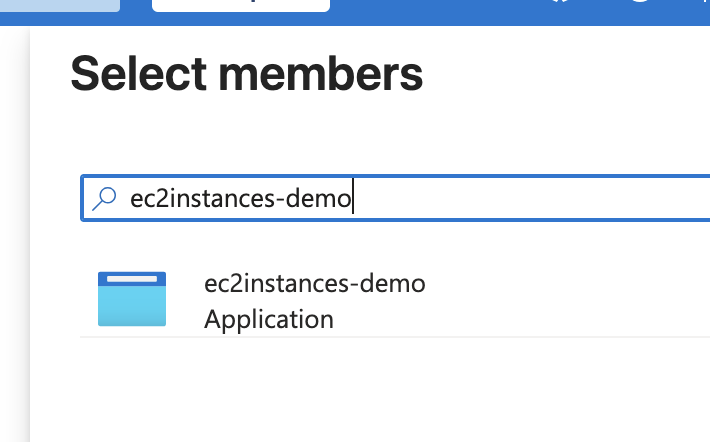

From here, click "Review + assign", make sure everything looks good, and then click it again. This is now tied to your subscription!

Go back to overview on this subscription and copy your subscription ID (this is your `AZURE_SUBSCRIPTION_ID`).

Congrats! You now have the `AZURE_TENANT_ID`, `AZURE_CLIENT_ID`, `AZURE_CLIENT_SECRET`, and `AZURE_SUBSCRIPTION_ID` enviornment variables you need!
